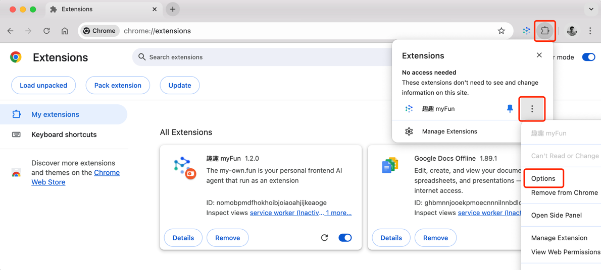
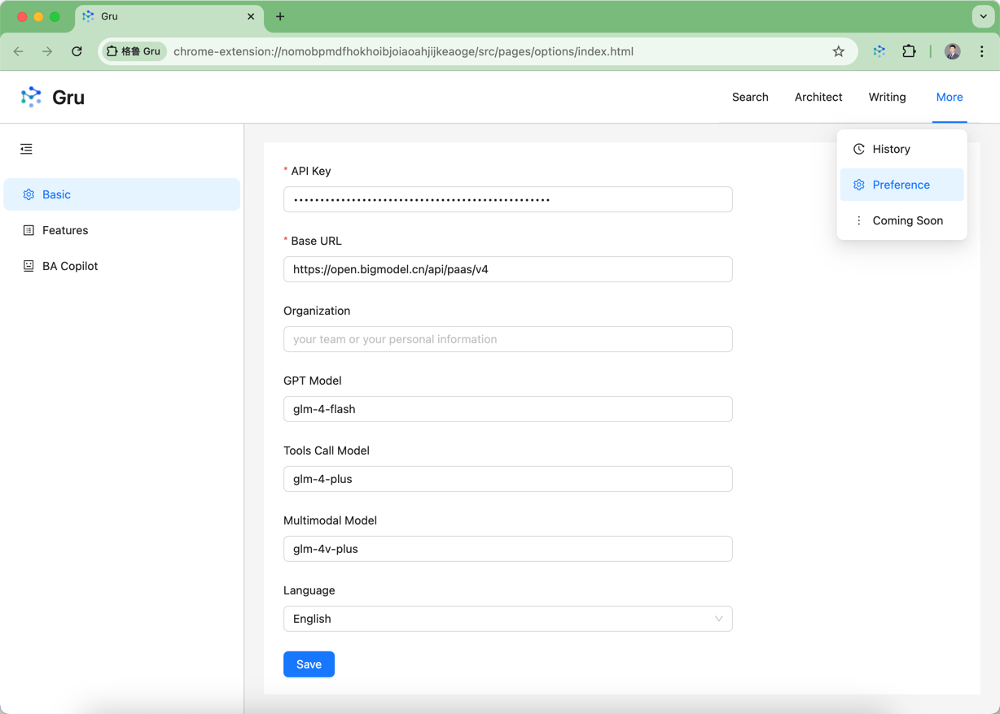

#  my-own.fun (myFun for short)

**TL;DR** The myFun is a prototype of On-Device AI Agent, run in browser as an extension.

## Project Goal
**For:** Geeky application software engineers

**Who:** Want to build intelligent applications for themselves or others, but there seems to be a lot to learn that holds them back, such as various AI models, knowledge graphs, MLOps, LLMOps, etc. Meanwhile, many of them are extremely care about the privacy.

**The** myFun

**IS A** Prototype of frontend AI agent (on device AI agent).

**THAT** Provide an examples of how to build intelligent applications with minimal AI knowledge and simple technology, it can be quickly adopted to other projects.

**UNLIKE** ChatGPT, DeepSeek, Kimi, [Sider.AI](https://sider.ai/), [Monica AI](https://monica.im/), and other AI assistants.

**OUR PRODUCT** is focusing on On-Device AI Agent (which is a complex intelligent application), and make software engineers easier to learn and build their own applications. It is open-source, free of charge, with a focus on enterprise cybersecurity, privacy
protection, and compliance requirements.

[More Details](docs/README.md)

## Build or Install

### Build from Source Code

1. Run npm install
2. Run build command:
    - Dev: `pnpm dev` or `npm run dev`
    - Prod: `pnpm build` or `npm run build`
3. Follow steps 2 to 5 in [Install from Package](#install-from-package).

### Install from Package
1. Download & unzip the latest release zip file from [releases page](https://github.com/yingrui/my-own.fun/releases).
2. Open in browser - `chrome://extensions`
3. Check - `Developer mode`
4. Find and Click - `Load unpacked extension`
5. Select - unzipped file folder or `dist` folder if you build from source code

You can pin extension in Google Chrome toolbar if you want.

## Configure myFun
Please entrance options page as below, and set up configurations.

In options page, you can see configuration page as below.

The key configurations are:
* **API Key**: Set api key from OpenAI, Zhipu AI, Baichuan or Ollama
* **Base URL**: base url from OpenAI, Zhipu AI, Baichuan or Ollama
* **Organization**: Your Organization Name
* **GPT Model**: glm-4-plus is default
* **Tools Call Model**: If it's empty, will not use tools call to recognize user intents.

Note: Since China is not supported by OpenAI, it's difficult to ensure the compatibility, you may need to implement `agents.services.ModelService`.

Please refer to [How to setup configurations](docs/tutorial/how_to_setup_configurations.md) for more details.

***NOTE:*** *Any OpenAI compatible GPT model API should work.*

## Others
* **Docs:** [Github Pages](https://yingrui.github.io/my-own.fun/)
* **Stay tuned for more updates:** By starring the myFun project, GitHub will automatically receive and notify you of the latest updates through your GitHub account.

### Star history

