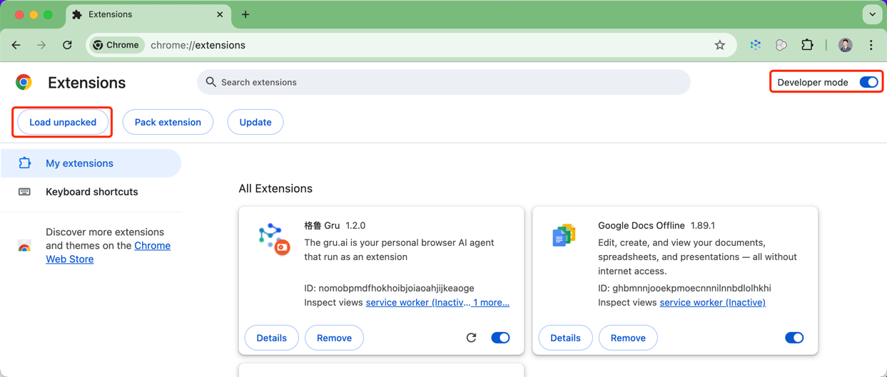

#  gru.ai

**TL;DR** The gru.ai is a prototype of On-Device AI Agent, run in browser as an extension.

## Project Goal
**For:** Geeky application software engineers

**Who:** Want to build intelligent applications for themselves or others, but there seems to be a lot to learn that holds them back, such as various AI models, knowledge graphs, MLOps, LLMOps, etc. Meanwhile, many of them are extremely care about the privacy.

**The** gru.ai

**IS A** Prototype of On Device AI agent.

**THAT** Provide an examples of how to build intelligent applications with minimal AI knowledge and simple technology, it can be quickly adopted to other projects.

**UNLIKE** ChatGPT, DeepSeek, Kimi, [Sider.AI](https://sider.ai/), [Monica AI](https://monica.im/), and other AI assistants.

**OUR PRODUCT** is focusing on On-Device AI Agent (which is a complex intelligent application), and make software engineers easier to learn and build their own applications.

[More Details](docs/README.md)

## Build or Install

### Build from Source Code

1. Run npm install
2. Run build command:
    - Dev: `pnpm dev` or `npm run dev`
    - Prod: `pnpm build` or `npm run build`
3. Follow steps 2 to 5 in [Install from Package](#install-from-package).

### Install from Package
1. Download & unzip the latest release zip file from [releases page](https://github.com/yingrui/gru.ai/releases).
2. Open in browser - `chrome://extensions`
3. Check - `Developer mode`
4. Find and Click - `Load unpacked extension`
5. Select - unzipped file folder or `dist` folder if you build from source code

6. Pin extension in Google Chrome toolbar

### Setup Configurations
Please set up below configurations in the extension popup page: 
* **API Key**: Set api key from OpenAI, Zhipu AI, Baichuan or Ollama
* **Base URL**: base url from OpenAI, Zhipu AI, Baichuan or Ollama
* **Organization**: Your Organization Name
* **GPT Model**: gpt-3.5-turbo is default
* **Tools Call Model**: If it's empty, will not use tools call to recognize user intents.

Please refer to [How to setup configurations](docs/tutorial/how_to_setup_configurations.md) for more details.

***NOTE:*** *Any OpenAI compatible GPT model API should work.*

## For Users
For who want to use this extension, please refer to below documents:
* [An Introduction to Gru](docs/tutorial/an_introduction_to_gru.md)
* [How to setup configurations](docs/tutorial/how_to_setup_configurations.md)
* [How to use this chrome extension](docs/tutorial/how_to_use_this_chrome_extension.md)
* [Interesting Use Cases](docs/tutorial/interesting_usecases.md)

## For Developers
For who want to contribute to this extension, please refer to below documents:
* [How to get web page content](docs/tasking/how_to_get_web_page_content.md)
* [How to add new agent and command](docs/tasking/how_to_add_new_agent_and_command.md)
* [How to update popup window for configuration](docs/tasking/how_to_update_popup_window_for_configuration.md)
* [How to develop test generation tool](docs/tasking/how_to_develop_test_generation_tool.md)