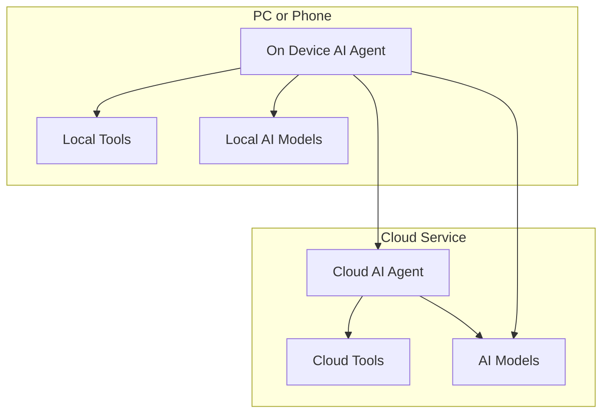
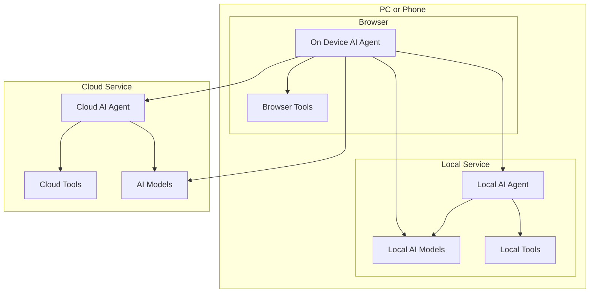

# Frontend AI Agent 

## What is Frontend AI Agent
There are several types of AI Agent (or AI Assistant) we've seen, such as:
 * **AI PC & AI Phone:** Siri, Microsoft Cortana, Huawei Celia (小艺), etc.
 * **AI Agent in Professional Software:** Github Copilot, Jira, Office 365, etc.
 * **Cloud AI Agent:** ChatGPT, DeepSeek, Gemini, etc.
 * **AI Agent in Browser:** Sider.AI, Monica, Kimi, etc.

When we talk about AI Agent, we usually think of Cloud AI Agent, but it is not the only choice. There are many of AI Agents are running on device side.

### On-Device AI Agent
The On-Device AI Agent is a kind of AI Agent that runs on the device side, such as PC, Phone, or IoT devices. Usually, it looks like below:

### On-Device AI Agent in Web Frontend
**The Frontend AI Agent** is a special case of On-Device AI Agent:
1. It runs in the Web browser, some use cases do not need networks, so it could be considered as On-Device AI Agent.
2. It is built with frontend technology stack.

## Why Frontend AI Agent

### The Perception of Frontend AI Agent
***The AI Agent should close to user.*** As On-Device AI Agent has advantages of environment perception, because it runs in the same environment as the user. 