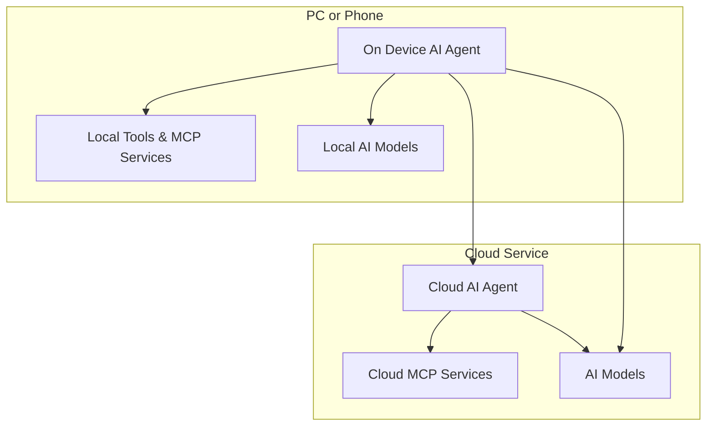
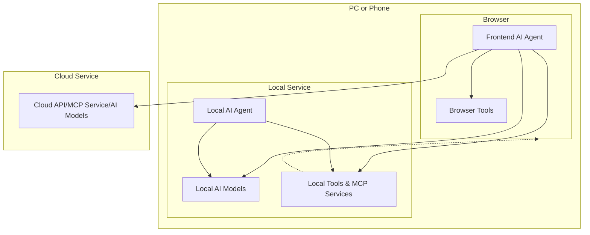

# Frontend AI Agent 

## What is Frontend AI Agent
There are several types of AI agent (or AI Assistant) we've seen, such as:
 * **AI PC & AI Phone:** Siri, Microsoft Cortana, Huawei Celia (小艺), etc.
 * **AI Agent in Professional Software:** Github Copilot, Jira, Office 365, etc.
 * **Cloud AI Agent:** ChatGPT, DeepSeek, Gemini, etc., or other AI agents that run on cloud (eg. AI Apps developed with Dify.ai).
 * **AI Agent in Browser:** Sider.AI, Monica, Kimi, etc. 

*`AI Agent in Browser` is similar to `AI Agent in Professional Software` (Web Browser), but the difference is that `AI Agents in Professional Software` cannot access other applications. For example, Github Copilot should not control Microsoft Office 365.*

`Cloud AI Agent` is probably the hottest topic right now, but considering that many AI Agents run on the device side, it is necessary to focus on `Front-end AI Agent`. At the same time, let us clarify this concept at first.

### On-Device AI Agent
The on-device AI agent is a kind of AI agent that runs on the device side, such as PC, Phone, or IoT devices. Usually, it looks like below:

### On-Device AI Agent in Web Frontend
**The frontend AI agent** is a special case of on-device AI agent:
1. It runs in the Web browser, some use cases do not need networks, so it could be considered as on-device AI agent.
2. It is built with frontend technology stack.

There are some frontend AI agents has been built for study, and here is a demo called AutoGLM:

<video width="640" height="480" controls="">
    <source src="https://xiao9905.github.io/AutoGLM/static/videos/web_overall_video.mp4" type="video/mp4">
</video>

[AutoGLM: Autonomous Foundation Agents for GUIs](https://xiao9905.github.io/AutoGLM/)

## Why Frontend AI Agent
> ***The embodied intelligence of World Wide Web.***

Beside autonomous planning capability, the key capabilities of frontend AI agent include:
* Perception Ability
* Action Capability

### Perception Ability
> ***The AI agent more close to user, the information it can get more.***

Frontend AI agent has advantages of environment perception, because it runs in the same environment as the user. It can:
* Get parsed DOM tree and layout information of each DOM node, it will help Agent to understand structure of web content.
* Get visual information of current page, this enable many use cases with multi-modal AI model.
* Access all open tabs, make AI Agent to collect more information and complete complex task.
* Get to know the browser history and bookmarks, for better understand the situation and intent of user.

### Action Capability
> ***The action capability of frontend AI agent is as same as user.***
* The AI agent in an app can only complete tasks within this app
* The frontend AI agent can imitate human operation like: click, scroll page, backward, etc.
* The frontend AI agent can impersonate user, it can do what the user can.

### Legacy Web Apps
> ***Lack of resource to enhance legacy Web apps with AI.***

The frontend of AI agent would be an cheaper and easier way to enhance legacy Web apps, which is affordable for enterprise or individual. For example, answering questions about the web page content, this is a common requirement for many web apps. 

### Comparison with Others
> ***Understand its advantages by comparative analysis.***

#### AI assistant in JIRA
If you want to generate or modify the content of User Story.
* Generate better content need information outside of JIRA, eg. user requirements, web product of competitors, etc.
* Not all of this information are saved in JIRA.
* User need to provide additional information to agent manually.

Frontend AI agent can access such information in a convenient way, but JIRA AI assistant is difficult to get it.

#### Comparison with Notion.ai
If you want to write some professional documents, usually you need to view some reference materials use browser.
* If the AI agent can get information from other opened tabs, it can provide more accurate information.
* Some references are confidential, the cloud AI agent can't get it. 

Frontend AI agent can get information from other opened tabs, but Notion.ai can't.

## How to Get Started
***The frontend AI agent is a new opportunity that is worth exploring and learning for all application software engineers.***

my-own.fun is built with TypeScript. It is a good example to learn how to build frontend AI agent, welcome to try and contribute!

