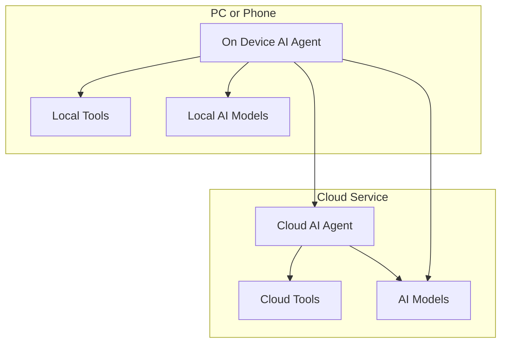
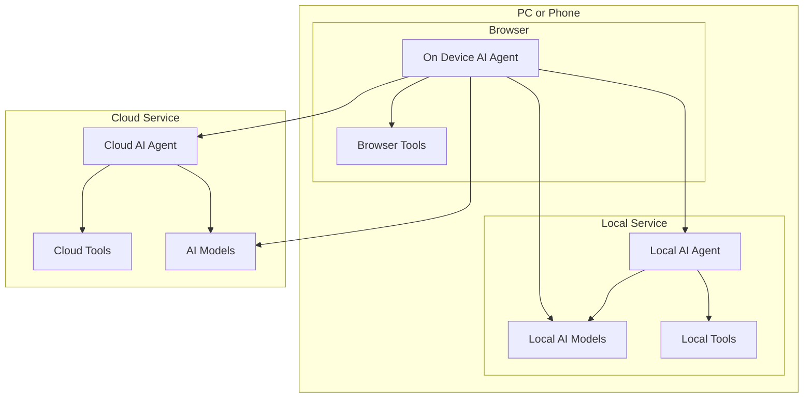

# 前端AI Agent 

## 前端AI Agent是什么
我们见过多种类型的AI Agent（或AI助手），例如：
 * **AI PC & AI手机：** 如Siri、微软小冰、华为小艺等
 * **专业软件中的AI Agent：** 如Github Copilot、Jira、Office 365等
 * **云端AI Agent:** 如ChatGPT、DeepSeek、Gemini等，或其他在云端运行的AI Agent（例如使用Dify.ai开发的AI应用）
 * **浏览器中的AI Agent：** 如Sider.AI、Monica、Kimi等 

*`浏览器中的AI Agent`与`专业软件中的AI Agent`（Web浏览器）类似，但区别在于`专业软件中的AI Agent`无法访问其他应用。例如，Github Copilot不应控制Microsoft Office 365。*

`云端AI Agent`可能是当前最热门的话题，但考虑到许多AI Agent在设备端运行，有必要关注`前端AI Agent`，同时让我们先澄清一下相关概念。

### 端侧AI Agent

端侧AI Agent是在设备端运行的AI Agent，例如PC、手机或IoT设备。通常其架构如下：

### Web前端中的端侧AI Agent

**前端AI Agent**是一种特殊的端侧AI Agent：
1. 它在Web浏览器中运行，在某些情况下不需要网络连接，因此可以被视为端侧AI Agent
2. 它使用前端技术栈开发

目前已有一些用于研究的前端AI Agent面世，例如下面AutoGLM的演示视频：

<video width="640" height="480" controls="">
<source src="https://xiao9905.github.io/AutoGLM/static/videos/web_overall_video.mp4" type="video/mp4">
</video>

[AutoGLM: Autonomous Foundation Agents for GUIs](https://xiao9905.github.io/AutoGLM/)

## 为什么需要前端AI Agent

> ***互联网世界的具身智能。***

除了自主规划能力外，前端AI Agent的关键能力包括：
- **感知能力**
- **行动能力**

### 感知能力

> ***AI Agent越接近用户，获取的信息就越多。***

前端AI Agent在环境感知方面具有非常大的优势，因为它与用户在同一环境中运行。它可以：
- 获取解析后的DOM树和每个DOM节点的布局信息，帮助Agent理解网页结构
- 获取当前页面的视觉信息，应用多模态AI模型支持更多场景
- 访问所有打开的标签页，使AI Agent能够收集更多信息并完成复杂任务
- 了解浏览器历史和书签，更好地理解用户的情况和意图

### 行动能力

> ***前端AI Agent的行动能力与用户相同。***

- 应用中的AI Agent只能在该应用内完成任务。
- 前端AI Agent可以模仿人类操作，如点击、滚动页面、后退等。
- 前端AI Agent可以模仿用户，它能做用户能做的任何事情。

### 传统Web应用

> ***缺少用AI增强原有Web应用的投入。***

前端AI Agent为增强传统Web应用提供了一种更便宜、更简单的方法，这对企业或个人来说都是负担得起的。例如，回答有关网页内容的问题，这是许多Web应用的常见需求。

### 与其他Agent的比较

> ***通过比较分析了解其优势。***

#### JIRA中的AI助手

如果你想生成或修改用户故事的内容：
- 生成更好的内容需要JIRA之外的信息，例如用户需求、竞争对手的Web产品等。
- 并非所有这些信息都保存在JIRA中。
- 用户需要手动向Agent提供额外信息。

前端AI Agent可以方便地访问此类信息，但JIRA AI助手难以获取。

#### 与Notion.ai的比较

如果你想撰写一些专业文档，通常需要使用浏览器查看一些参考资料：
- 如果AI Agent能从其他打开的标签页获取信息，它可以提供更准确的信息。
- 有些参考资料是机密的，云端AI Agent无法访问这些内部信息。

前端AI Agent可以从其他打开的标签页获取信息，但Notion.ai不能。

## 如何开始

***前端AI Agent是一个值得所有应用软件工程师探索和学习的新机会。***

my-own.fun是用TypeScript开发的一个学习如何构建前端AI Agent的好例子，欢迎尝试和贡献！

